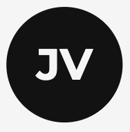

<a id="readme-top"></a>

[![LinkedIn][linkedin-shield]][linkedin-url]

<!-- PROJECT LOGO -->
<br />
<div align="center">
  <a href="https://github.com/johncookv/vehikite-nextjs-portfolio">
    
  </a>

  <h3 align="center">John Vehikite Portfolio</h3>

  <p align="center">
    
  </p>
</div>

<!-- TABLE OF CONTENTS -->
<details>
  <summary>Table of Contents</summary>
  <ol>
    <li>
      <a href="#about-the-project">About The Project</a>
      <ul>
        <li><a href="#built-with">Built With</a></li>
      </ul>
    </li>
    <li>
      <a href="#getting-started">Getting Started</a>
      <ul>
        <li><a href="#prerequisites">Prerequisites</a></li>
      </ul>
    </li>
    <li><a href="#usage">Usage</a></li>
    <li><a href="#roadmap">Roadmap</a></li>
    <li><a href="#contributing">Contributing</a></li>
    <li><a href="#license">License</a></li>
    <li><a href="#contact">Contact</a></li>
    <li><a href="#acknowledgments">Acknowledgments</a></li>
  </ol>
</details>

<!-- ABOUT THE PROJECT -->

## About The Project

[![Portfolio Screen Shot][product-screenshot]](https://johncookv-portfolio.vercel.app/)

There are many portfolio websites out there, but I wanted one
that was eye catching and would allow me to learn/practice
technologies that I haven't used in a full project yet.

I used a wonderful [tutorial](https://www.youtube.com/watch?v=Yw7yWHigGKI) as a base, but I refactored some parts and changed others to fit my style.

<p align="right">(<a href="#readme-top">back to top</a>)</p>

### Built With

- [![Next][Next.js]][Next-url]
- [![React][React.js]][React-url]
- [![Tailwind CSS][TailwindCSS]][TailwindCSS-url]
- [![Framer Motion][Framer-Motion]][Framer-Motion-url]
- [![Vercel][Vercel]][Vercel-url]

<p>

<p align="right">(<a href="#readme-top">back to top</a>)</p>

<!-- GETTING STARTED -->

## Getting Started

To run this project locally:

- Clone the project
- Run `npm install`
- Run `npm run dev`

### Prerequisites

Make sure you have `node` installed

- npm
  ```sh
  npm install npm@latest -g
  ```

<!-- USAGE EXAMPLES -->

## Usage

Since my work project runs on port 3000, I have the default port of this project as 3001. After running `npm run dev`, you can see the project running on [http://localhost:3001/](http://localhost:3001/).

<p align="right">(<a href="#readme-top">back to top</a>)</p>

<!-- ROADMAP -->

## Roadmap

- [x] Create Portfolio MVP
- [x] Deploy via Vercel
- [x] Make responsive
- [ ] Add dark mode
- [ ] Create articles and add to articles page

<p align="right">(<a href="#readme-top">back to top</a>)</p>

<!-- CONTRIBUTING -->

## Contributing

Contributions are what make the open source community such an amazing place to learn, inspire, and create. Any contributions you make are **greatly appreciated**.

If you have a suggestion that would make this better, please fork the repo and create a pull request. You can also simply open an issue with the tag "enhancement".
Don't forget to give the project a star! Thanks again!

1. Fork the Project
2. Create your Feature Branch (`git checkout -b feature/AmazingFeature`)
3. Commit your Changes (`git commit -m 'Add some AmazingFeature'`)
4. Push to the Branch (`git push origin feature/AmazingFeature`)
5. Open a Pull Request

<p align="right">(<a href="#readme-top">back to top</a>)</p>

<!-- LICENSE -->

## License

Distributed under the MIT License. See `LICENSE.txt` for more information.

<p align="right">(<a href="#readme-top">back to top</a>)</p>

<!-- CONTACT -->

## Contact

John Vehikite - [LinkedIn](https://www.linkedin.com/in/johnvehikite/) - [johncookv@gmail.com](mailto:johncookv@gmail.com)

Project Link: [https://github.com/johncookv/vehikite-nextjs-portfolio](https://github.com/johncookv/vehikite-nextjs-portfolio)

<p align="right">(<a href="#readme-top">back to top</a>)</p>

<!-- ACKNOWLEDGMENTS -->

## Acknowledgments

[Codebucks](https://github.com/codebucks27) for providing a great [tutorial](https://www.youtube.com/watch?v=Yw7yWHigGKI).

<p align="right">(<a href="#readme-top">back to top</a>)</p>

<!-- MARKDOWN LINKS & IMAGES -->

[linkedin-shield]: https://img.shields.io/badge/-LinkedIn-black.svg?style=for-the-badge&logo=linkedin&colorB=555
[linkedin-url]: https://linkedin.com/in/johncookv
[product-screenshot]: public/images/screenshot.png
[Next.js]: https://img.shields.io/badge/next.js-000000?style=for-the-badge&logo=nextdotjs&logoColor=white
[Next-url]: https://nextjs.org/
[React.js]: https://img.shields.io/badge/React-20232A?style=for-the-badge&logo=react&logoColor=61DAFB
[React-url]: https://reactjs.org/
[TailwindCSS]: https://img.shields.io/badge/tailwindcss-%2338B2AC.svg?style=for-the-badge&logo=tailwind-css&logoColor=white
[TailwindCSS-url]: https://tailwindcss.com/
[Framer-Motion]: https://img.shields.io/badge/Framer-black?style=for-the-badge&logo=framer&logoColor=blue
[Framer-Motion-url]: https://www.framer.com/motion/
[Vercel]: https://img.shields.io/badge/vercel-%23000000.svg?style=for-the-badge&logo=vercel&logoColor=white
[Vercel-url]: https://www.framer.com/motion/
